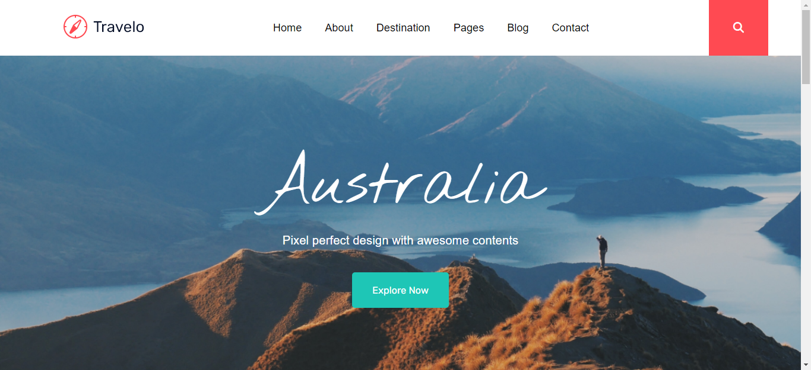
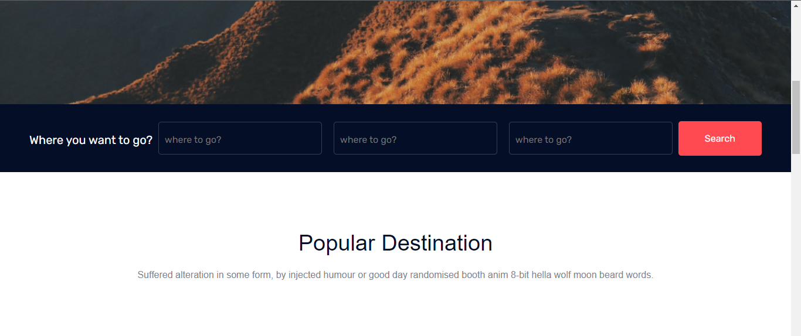
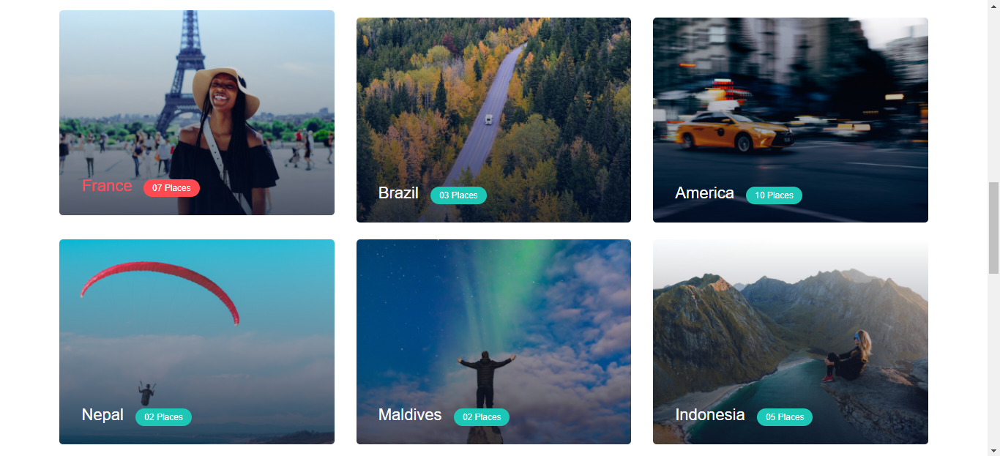

# Travelo - Tourism Management

This project is a tourism management webpage called Travelo. It provides information about various destinations, allows users to search for places, and offers a newsletter subscription.

## Features

- Responsive design
- Navigation menu with links to different sections
- Search bar for finding travel destinations
- Popular destination section with images and place information
- Newsletter subscription form
- Video section for enjoying travel-related videos
- Footer with contact information and popular destination links

## Technologies Used

- HTML
- CSS
- JavaScript

## Usage

To use or contribute to this project, follow these steps:

1. Clone the repository: `git clone https://github.com/sadeq-yaqobi/travelo-turism-webpage.git`
2. Open the index.html file in your web browser.
3. Explore the different sections and functionalities of the webpage.

## Screenshots

Include relevant screenshots of your project here.

## License

This project is licensed under the [MIT License](LICENSE).

## Contact

For any questions or inquiries, feel free to contact the project owner [here](https://github.com/sadeq-yaqobi).

